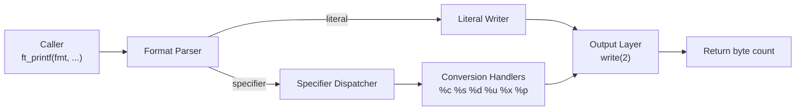

# ft_printf

> A minimal reimplementation of the C standard library’s `printf`, built from scratch using variadic arguments and the POSIX `write(2)` syscall.


---

# Table of Contents
* [Overview](#overview)
* [Design Goals](#design-goals)
* [Supported Specifiers](#supported-specifiers)
* [Architecture](#architecture)
* [Data Flow](#data-flow)
* [Usage](#usage)
* [Performance & Edge Cases](#performance--edge-cases)
* [Engineering Notes](#engineering-notes)

---

# Overview

`ft_printf` is a ground-up implementation of a subset of the standard `printf` formatting system.

The function parses a format string at runtime, extracts arguments using the C variadic argument API (`va_list`, `va_start`, `va_arg`), dispatches them to the appropriate conversion handler, and writes the resulting character stream directly to stdout via `write(2)`.

The result is a small dependency-free static library (`libftprintf.a`) that reproduces core `printf` behavior without relying on any formatting utilities from `libc`.

---

# Design Goals

The implementation focuses on making the formatting pipeline explicit and easy to reason about.

| Goal                         | Rationale                                                 |
| ---------------------------- | --------------------------------------------------------- |
| Correct formatting behavior  | Match standard `printf` behavior for supported specifiers |
| Explicit formatting pipeline | Separate parsing, dispatch, and conversion                |
| Low-level output control     | Perform all writes via `write(2)`                         |
| Minimal dependencies         | No use of `stdio` formatting utilities                    |

---

# Supported Specifiers

| Specifier   | Description              |
| ----------- | ------------------------ |
| `%c`        | Character                |
| `%s`        | String                   |
| `%p`        | Pointer address          |
| `%d` / `%i` | Signed decimal integer   |
| `%u`        | Unsigned decimal integer |
| `%x`        | Lowercase hexadecimal    |
| `%X`        | Uppercase hexadecimal    |
| `%%`        | Literal `%` character    |

---

# Architecture

`ft_printf` operates as a **single-pass formatting pipeline**.

The format string is scanned from left to right. Literal characters are written directly, while conversion specifiers trigger a dispatch step that routes the corresponding argument to the correct handler.



### Components

| Component     | Responsibility                               |
| ------------- | -------------------------------------------- |
| `ft_printf`   | Entry point, manages `va_list` and iteration |
| Format parser | Scans the format string                      |
| Dispatcher    | Maps specifiers to handlers                  |
| Handlers      | Convert arguments to text                    |
| Output layer  | Writes characters via `write(2)`             |

---

# Data Flow

Example call:

```c
ft_printf("Value: %d, addr: %p\n", n, &n);
```

Execution proceeds as follows:

1. `va_start` initializes the variadic argument list.
2. The format string is scanned character by character.
3. Literal characters are written directly.
4. When `%` is encountered, the next character determines the conversion type.
5. The corresponding argument is retrieved with `va_arg`.
6. The dispatcher routes the value to the correct conversion handler.
7. The handler converts the value to text and writes it via `write(2)`.
8. The total number of bytes written is accumulated and returned.

---

# Usage

Build the static library:

```sh
git clone https://github.com/artclave/printf-42.git
cd printf-42
make
```

This produces:

```
libftprintf.a
```

Link into a program:

```sh
gcc main.c -L. -lftprintf -Iincludes
```

Example program:

```c
#include "ft_printf.h"

int main(void)
{
    int n = 42;

    ft_printf("Value: %d | Hex: %x | Pointer: %p\n", n, n, (void *)&n);
}
```

---

# Performance & Edge Cases

### Complexity

Formatting cost is proportional to the length of the output.

| Operation         | Complexity |
| ----------------- | ---------- |
| Format parsing    | O(n)       |
| Number conversion | O(digits)  |

---

### Edge Cases Handled

| Scenario       | Behavior                                    |
| -------------- | ------------------------------------------- |
| `INT_MIN`      | Safe conversion via wider integer promotion |
| `NULL` strings | Printed as `(null)`                         |
| Pointer width  | Correct handling on 64-bit systems          |
| Write failure  | Propagates `-1` to the caller               |

---

# Engineering Notes

* **Variadic argument dispatch**
  The implementation uses `va_list` to consume heterogeneous arguments at runtime and route them to the correct conversion handlers.

* **Error propagation**
  All output passes through a single write layer. Any `write(2)` failure immediately propagates `-1` up to the caller.

* **Integer conversion edge cases**
  Signed integers are promoted to a wider type before negation to safely handle `INT_MIN`.

* **Modular formatting pipeline**
  Separating parsing, dispatch, and formatting keeps each stage simple and makes extending the formatter straightforward.

---
